# Cute Dog Luna Services
Welcome to my Website Project about my cute Dog Luna and the services she wants to provide.
It is complete with an contact form for potential dog lovers to get in contact with Me and Luna, an gallery section to show people some of Luna's beautiful pictures.
On the Homepage you can read all about Luna's Biography and find the services she offers to you.

This website has been created as the first Portfolio project for Code Institute's Full Stack Software Development Diploma. It was built using HTML and CSS. GitPod was used for writing the code for this website, as well as committing and pushing to GitHub. GitHub was then used to store the project after it had been pushed from GitPod. Once all the code had been written, GitPages was then used to deploy the website.

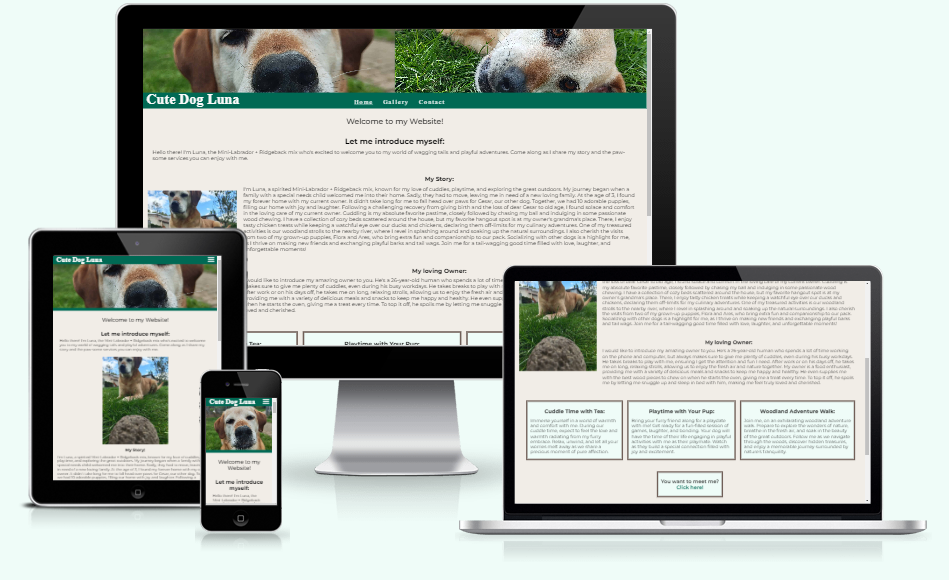

### View the live website [here](https://valejmdev.github.io/cutedoglunapp1/)
***
## Table of content: 
 1. [UX](#UX)
    1. [User Stories](#User-Stories)
    1. [Wireframes](#Wireframes)
    1. [Color](#Color)
    1. [Font](#Font)
    1. [Images](#Images)
 1. [Features](#Features)
    1. [General](#General)
    1. [Home page](#Home-page)
    1. [Gallery](#Gallery)
    1. [Contact](#Contact)
 1. [Testing](#Testing)
	1. [General Testing](assets/docs/readmepages/TESTING.md)
	2. [Mobile Testing](assets/docs/readmepages/TESTING.md)
	3. [Desktop Testing](assets/docs/readmepages/TESTING.md)
	4. [Functionality](assets/docs/readmepages/TESTING.md)
 	5. [Website Development Issues](assets/docs/readmepages/TESTING.md)
 	6. [Bugs](assets/docs/readmepages/TESTING.md)
 	7. [Technologies Used](assets/docs/readmepages/TESTING.md)
 	8. [Validation](assets/docs/readmepages/TESTING.md)
	9. [W3C HTML](assets/docs/readmepages/TESTING.md)
	10. [W3C Jigsaw](assets/docs/readmepages/TESTING.md)
 	11. [Accessibility](assets/docs/readmepages/TESTING.md)
 	12. [Deployment](assets/docs/readmepages/TESTING.md)
 1. [Credits](#Credits)
      1. [Content](#Content)
      2. [Media](#Media)
      3. [Code](#Code)
 5. [Acknowledgements](#Acknowledgements)
***

## UX: 

### User Stories: 
#### Persona:
-   **Demographics**:
    -   **Age**: 30
    -   **Gender**: Female
    -   **Occupation**: Marketing Manager
    -   **Location**: Urban area
-   **Background**:
    -   Sarah is a dog lover who has been following Luna's social media accounts for a while.
    -   She enjoys spending time outdoors and values the companionship of dogs.
    -   Sarah is tech-savvy and appreciates well-designed websites that offer personalized experiences.
-   **Goals**:
    -   Wants to treat herself and her dog to a special experience.
    -   Seeks a reliable and trustworthy service for her dog's well-being.
    -   Hopes to find a service that aligns with her dog's preferences and needs.
-   **Challenges**:
    -   Finding time for her dog's socialization and exercise needs.
    -   Ensuring her dog is in good hands when she's busy with work.
    -   Wanting to give her dog unique and enjoyable experiences.
-   **How Luna's Website Meets Sarah's Needs**:
    -   The personalized introduction by Luna resonates with Sarah's love for dogs.
    -   Luna's biography showcases a caring and playful personality, appealing to Sarah's desire for a loving environment for her dog.
    -   The variety of services offered, including cuddle time and walks in the woods, align with Sarah's preferences for enriching experiences for her dog.
    -   The easy-to-navigate booking page provides a seamless process for Sarah to schedule a service for her dog, meeting her need for convenience and reliability.

By embodying the persona of Sarah, Luna's enthusiastic visitor, the website can cater to the needs and preferences of dog lovers like her, offering a welcoming and engaging platform to book services for their furry companions.
***
#### Detailed User Journey
##### Homepage:

1.  **Arrival**:
    -   Sarah enters the website and is immediately welcomed by Luna, a charming introduction capturing Sarah's attention.
    -   Luna's warm greeting sets a positive tone for Sarah's browsing experience.
2.  **Biography**:
    -   Sarah delves into Luna's biography, eager to learn more about this beloved dog:
        -   Discovers Luna's age of **9 years** and her heartwarming story of joining the family at **3 years old**.
        -   Reads about Luna's experience as a mother to puppies **4 years ago**, showcasing her nurturing side.
        -   Learns about Luna's favorite pastimes, including playing with **rubber balls, sticks, and stones**, and her love for **cuddling** and socializing.
3.  **Services**:
    -   Sarah explores the array of services available to pamper Luna:
        -   **Cuddle Time with Tee**: Offers Luna a chance to enjoy cozy moments and affection.
        -   **Playtime with the Customer's Dog**: Provides Luna with social interaction and fun play sessions.
        -   **Big Walk in the Woods**: Presents Luna with an exciting outdoor adventure to explore nature.
4.  **Decision**:
    -   Sarah contemplates Luna's preferences and selects the service that best suits Luna's personality and needs.
    -   Considers Luna's love for cuddling, playing, and outdoor activities to make an informed choice.
      
***
#### Gallery Page:

1.  **Exploration**:
    -   Sarah navigates to the gallery page, excited to view a collection of captivating images of Luna.
    -   Admires Luna's adorable poses, playful antics, and heartwarming moments captured in the photos.
    -   Feels a deeper connection with Luna through the visual storytelling of her life and personality.

***
### ContactPage:

1.  **Service Selection**:
    -   Sarah carefully chooses the service that she believes Luna will enjoy and benefit from the most.
    -   Considers Luna's preferences, activity level, and social needs to make a personalized selection.
2.  **Booking Process**:
    -   Sarah enters the required details to book the chosen service, ensuring a seamless and user-friendly booking experience.
    -   Confirms the booking with anticipation, looking forward to providing Luna with a delightful and tailored experience.

This detailed user journey crafted for Sarah's persona aims to immerse her in Luna's world, offering a personalized and engaging website experience that resonates with her love for dogs and desire to provide Luna with enriching and enjoyable services.
***

### Wireframes: 
- I created my Wireframes in preparation for the project.
- While creating the website you can see today, i had to change some elements for design and time reasons.

**Elements you might find missing from the live Website:**
- A picture of Me
- A calendar on the contact form
- Different Layouts have been changed for visibility and accessibility 

- To see all Wireframes, click [here](assets/docs/readmepages/WIREFRAMES.md)

Here is an example from my homepage:
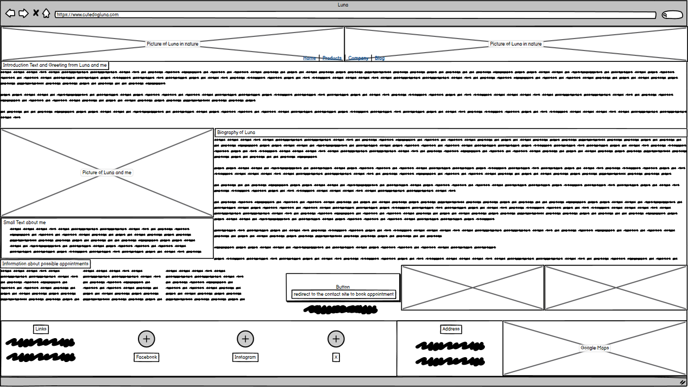
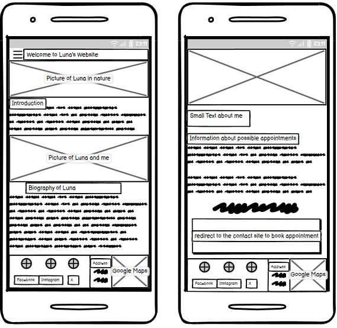

***
### Color: 
- I have been inspired by the design of this [Website](https://www.thekennelclub.org.uk).
- With that inspiration i created a color palette [here](https://mycolor.space/?hex=%23006954&sub=1)
- On the website mycolor.space i chose the Discrete Palette, because the colors correspond with the colors of the images i uploaded:
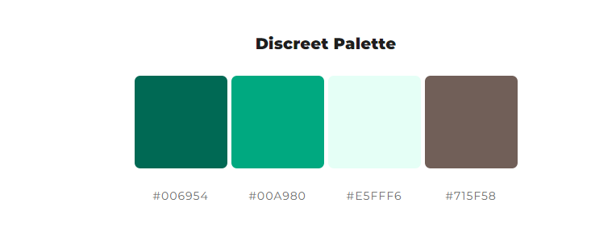

- I tested my Color Contrast with this [Website](https://coolors.co/contrast-checker/fafafa-006954)

I got the following values, which solidified my design choice:
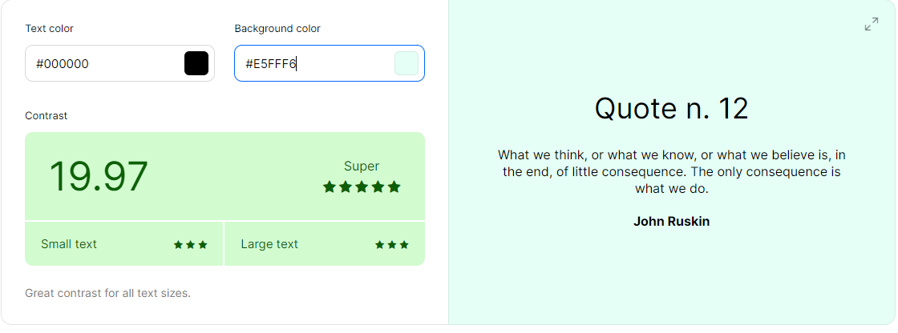
***

***
### Font: 
- I chose the current font, the Montserrat font family, as it is  a modern and versatile sans-serif typeface. Its clean design and legibility make it perfect for a wide range of projects, and its geometric design gives it a unique personality that can help make a website or design stand out.
[Google Fonts "Montserrat-Font"](https://fonts.google.com/specimen/Montserrat?preview.text=Cute%20dog%20Luna&query=Mon)
***
### Images: 
- All Images were taken by myself and Luna, Cesar and Flora gave consent to upload them. 
- I relied only on my own images, to avoid any copyright issues and to learn how to properly treat images i have taken myself.
***
## Features: 
### General: 
- The Header Element shows 1 to 2 pictures, depending on screen size.
- It  invites the user to giggle about the close nose and innocent gaze.

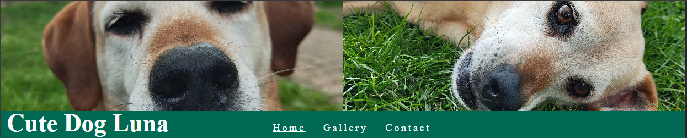

- The Nav Element has a hover animation that increases the size of the individual Text for accessibility.
- The current page will be highlighted by an underline to keep the user oriented.

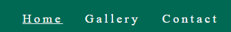

- I added an Address and Google Maps Integration from [Embedded Map](https://www.embed-map.com/). 
- This helps the user to plan his visit ahead of booking the service the user desires.

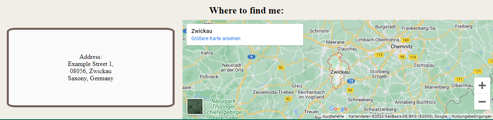

- The Footer Element contains Social Media Links to Facebook, Twitter and Instagram.
- The Icons contain the Link and will redirect the user to the desired Social Media Platform in a new tab.

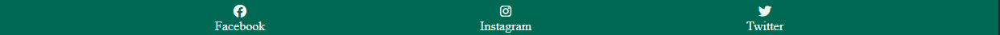

### Home page: 
- The Introduction Text greets the user and invites to read and see more of the page.

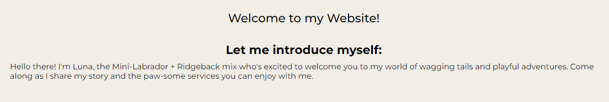

- The Biography contains a lot of relevant Information for the user to learn about Luna.

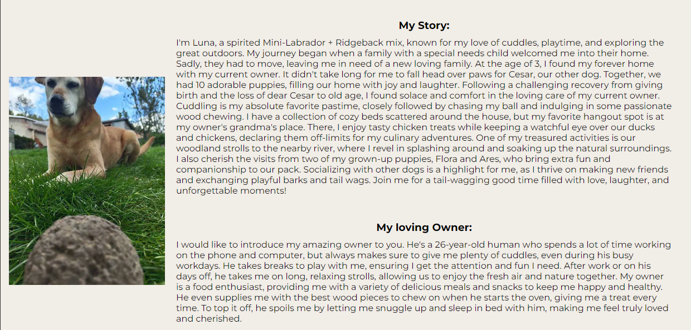

- I have added 3 Service boxes that describe the possible bookings the user can choose from.
- I added a hover Animation for UX that increase the size of the boxes.
- Below, you can see the Call to Action Box, that redirects the User to the Contact page.

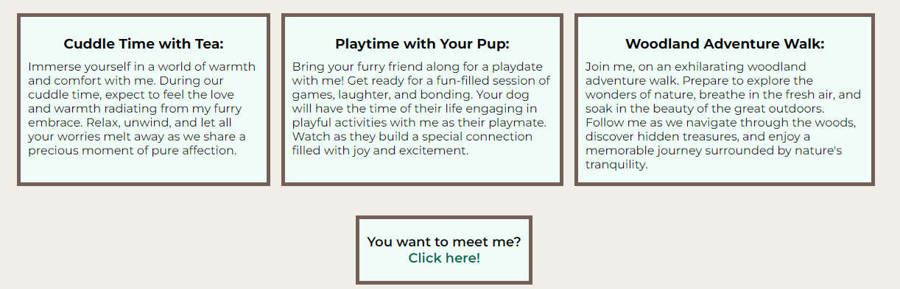

- Let's Take a closer look at the Call to Action. 
- The box has a hover animation that increases the size of the box.
- The Link has a hover animation as well that increases the size of the text.
It is the last element of the page, encouraging the user to book his desired service after taking a look at the content of the page.

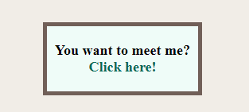

### Gallery:
- The Introduction Text of the Gallery invites the user to take a look at each picture and read the descriptions

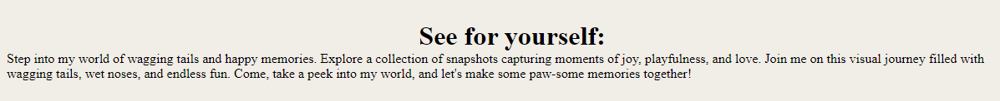

- The Images and Descriptions of the Gallery page were all taken and written by me.
- I have added a responsive Design to ensure any screen size can enjoy the beauty of Luna.
- For the social aspect of inviting other dogs to play with Luna, i have chosen to use pictures where she is with other dogs.

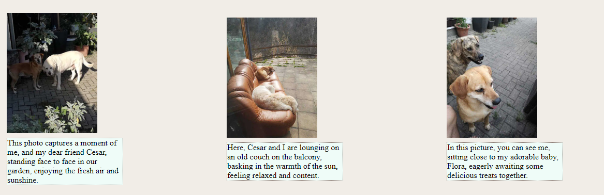

- I have added another Call to Action box to the gallery to encouraging the user to book his desired service after taking a look at the content of the page.

### Contact: 
- I have added the 3 Service boxes that describe the possible bookings the user can choose from again on the contact page to make it easier to choose the desired option on the contact form.
- I added a hover Animation for UX that increase the size of the boxes.

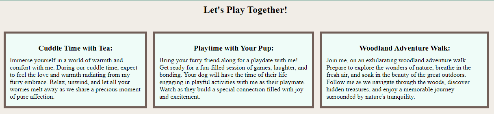

- The Form Element has 3 fieldset elemnts.
- One for the personal information to contact the user and enable a fluid booking process.
- Another for the desired Option of Services the user can choose from.
- At last there is a part for the Terms and Conditions and a Button to submit the contact form.

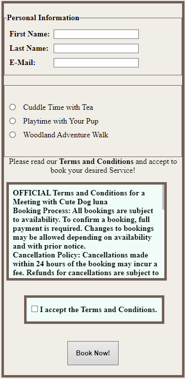

- On the left and right side of the contact form, Luna will watch you with an excited focus.
This is to ensure the User stays motivated to meet Luna.

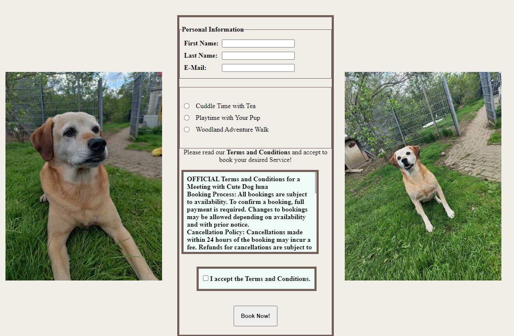

- After Submitting the form with all valid inputs, you will be redirected to this congratulations page.
- This is a placeholder, provided from Code Institute.
- If this page is displayed, the form element works as intended.

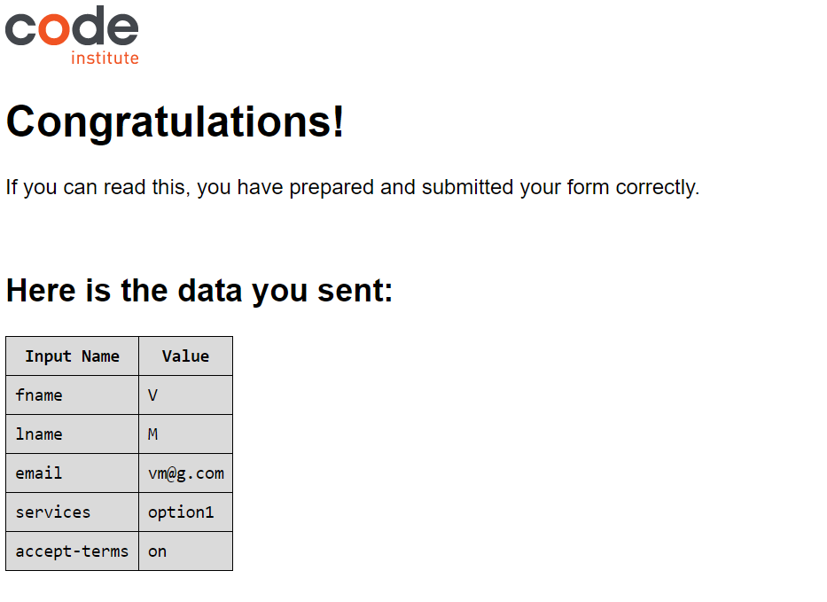

### Missing Features
- I only miss one feature i planned in preparation of this project.
The Feature i miss is a calender view on the Contact page, showing availability for possible bookings.
I wish to implement this feature in the future, but could not include it with the time given.

## Testing
**Due to the length of my Testing Section, i have created an extra Page**

[Click Here](assets/docs/readmepages/TESTING.md)

## Credits 
### Content: 
Inspiration for the design and colors: 

- [The Kennel Club](https://www.thekennelclub.org.uk)

- [mycolor.space](https://mycolor.space/?hex=%23006954&sub=1)

For the README i have been inspired by the following projects:

- [Dapper Hill Dog Boutique](https://github.com/Cushione/dapper-hill-dog-boutique/tree/main)
- [Horizon Photo](https://github.com/Ri-Dearg/horizon-photo/tree/master)
- [Flawless Cooking](https://github.com/Martiless/flawlesscooking/tree/main?tab=readme-ov-file#Deployment)
- [Travel World - Website](https://github.com/PedroCristo/portfolio_project_1?tab=readme-ov-file#bugs)

### Media: 
- Nothing Phone (2) for providing me with such a beautiful camera.

- My Dog for posing so perfectly to fill the page with her beauty.

- [Fontawesome](https://fontawesome.com/) for the Social Media Icons and the Favicon.

- [short pixel](https://shortpixel.com) to resize all images i took and used on this website.

- [Google Fonts "Montserrat-Font"](https://fonts.google.com/specimen/Montserrat?preview.text=Cute%20dog%20Luna&query=Mon) for providing a fitting Font.

### Code: 
- [Flexbox Froggy](https://flexboxfroggy.com/#de) making me understand Flexbox.
- [W3 Schools](https://www.w3schools.com) for so many properties and values i needed information about.
- [MDN](https://developer.mozilla.org/en-US/) for so many properties and values i needed information about.

- [stack overflow](https://stackoverflow.com) For many ideas and inspirations of solutions.

- I also took a lot of Inspiration from the Coders Coffeehouse project and the Love Running project.

## Acknowledgements: 
- A very special thanks to Pascal and Lorenz, two of the most helpful peers i wouldn't ever want to miss.  They have helped me tremendously with ideas, fixes and feedback.

- I also want to thank my Mentor Rory-Patrick who gave me so many tips and tricks, and inspired me along the way.

- Also very special thanks to my dog who not only seems to have written all the texts, posed for pictures and provided emotional support.

- I thank all my peers in my course, who provided a lot of support and feedback!

- I thank all my family members and friends who not only gave feedback and support but also tested it on their devices.

