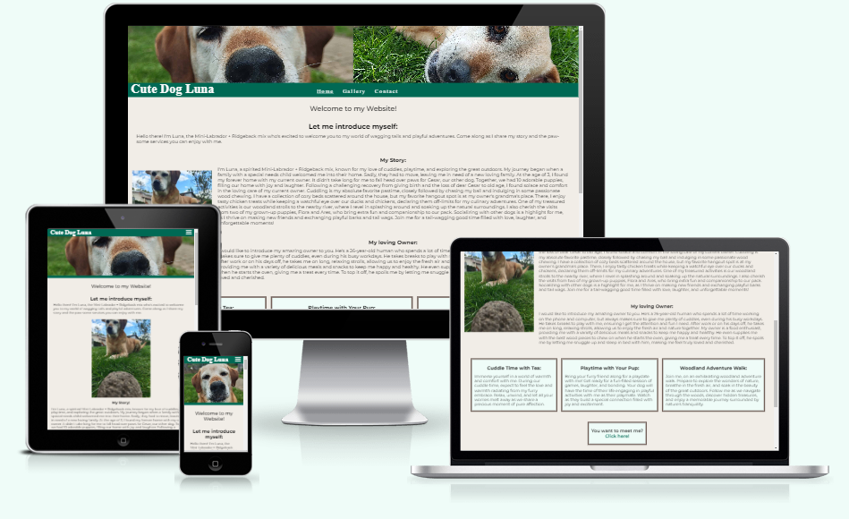
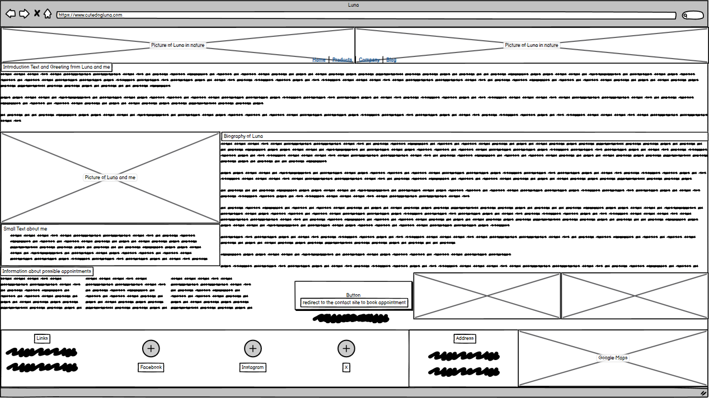
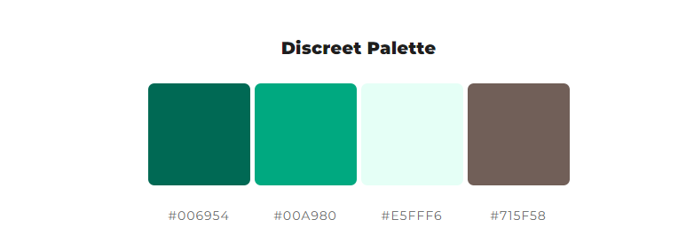
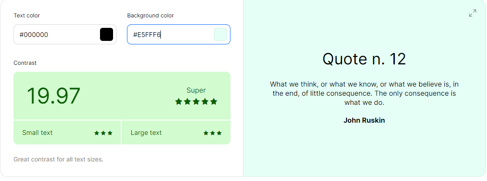
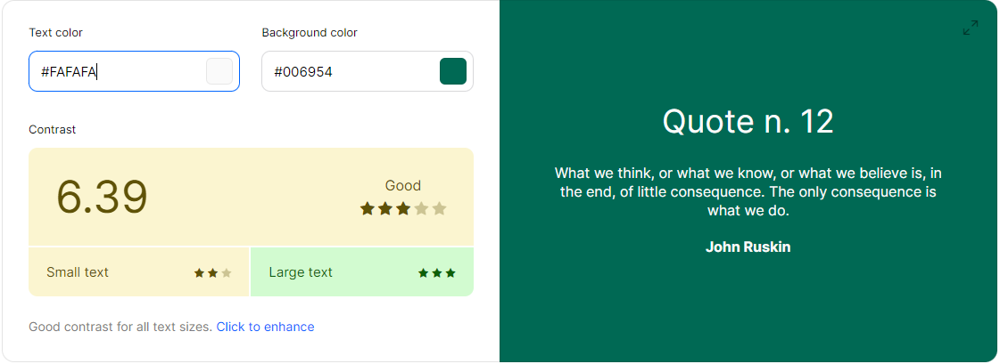
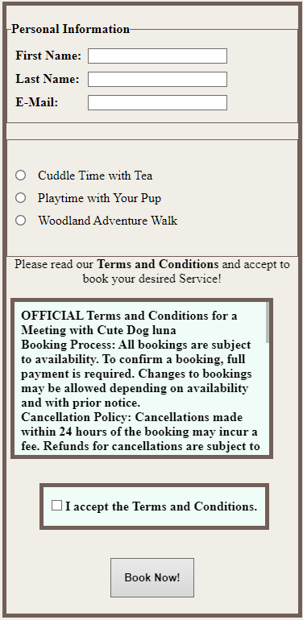
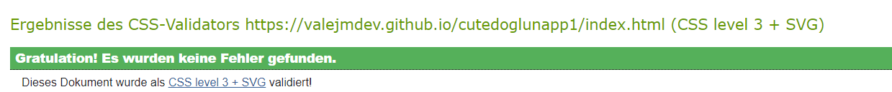

# Cute Dog Luna Services
Welcome to my Website Project about my cute Dog Luna and the services she wants to provide.
It is complete with an contact form for potential dog lovers to get in contact with Me and Luna, an gallery section to show people some of Luna's beautiful pictures.
On the Homepage you can read all about Luna's Biography and find the services she offers to you.

This website has been created as the first Milestone project for Code Institute's Full Stack Software Development Diploma. It was built using HTML and CSS. GitPod was used for writing the code for this website, as well as committing and pushing to GitHub. GitHub was then used to store the project after it had been pushed from GitPod. Once all the code had been written, GitPages was then used to deploy the website.

### View the live website [here](https://valejmdev.github.io/cutedoglunapp1/)
***
## Table of content: 
 2. [UX](#UX)
      1. [User Stories](#User-Stories)
      1. [Wireframes](#Wireframes)
      1. [Color](#Color)
      1. [Font](#Font)
      1. [Images](#Images)
 3. [Features](#Features)
      1. [General](#General)
      1. [Home page](#Home-page)
      1. [Gallery](#Gallery)
      1. [Contact](#Recipes)
 4. [Testing](#Testing)
	  1. [General Testing](#General-Testing)
	  2. [Mobile Testing](#Mobile-Testing)
	  3. [Desktop Testing](#Desktop-Testing)
	  4. [Functionality](#Functionality) 
 5. [User Stories Met](#User-Stories-Met)
 6. [Bugs](#Bugs)
 7. [Technologies Used](#Technologies-Used)
 8. [Validation](#Validation)
	 1. [W3C HTML](#W3C-HTML)
	 1. [W3C Jigsaw](#W3C-Jigsaw)
 9. [Accessibility](#Accessibility)
 10. [Deployment](#Deployment)
 11. [Credits](#Credits)
      1. [Content](#Content)
      2. [Media](#Media)
      3. [Code](#Code)
 12. [Acknowledgments](#Acknowledgments)
***

## UX: 

### User Stories: 
#### Persona:
-   **Demographics**:
    -   **Age**: 30
    -   **Gender**: Female
    -   **Occupation**: Marketing Manager
    -   **Location**: Urban area
-   **Background**:
    -   Sarah is a dog lover who has been following Luna's social media accounts for a while.
    -   She enjoys spending time outdoors and values the companionship of dogs.
    -   Sarah is tech-savvy and appreciates well-designed websites that offer personalized experiences.
-   **Goals**:
    -   Wants to treat herself and her dog to a special experience.
    -   Seeks a reliable and trustworthy service for her dog's well-being.
    -   Hopes to find a service that aligns with her dog's preferences and needs.
-   **Challenges**:
    -   Finding time for her dog's socialization and exercise needs.
    -   Ensuring her dog is in good hands when she's busy with work.
    -   Wanting to give her dog unique and enjoyable experiences.
-   **How Luna's Website Meets Sarah's Needs**:
    -   The personalized introduction by Luna resonates with Sarah's love for dogs.
    -   Luna's biography showcases a caring and playful personality, appealing to Sarah's desire for a loving environment for her dog.
    -   The variety of services offered, including cuddle time and walks in the woods, align with Sarah's preferences for enriching experiences for her dog.
    -   The easy-to-navigate booking page provides a seamless process for Sarah to schedule a service for her dog, meeting her need for convenience and reliability.

By embodying the persona of Sarah, Luna's enthusiastic visitor, the website can cater to the needs and preferences of dog lovers like her, offering a welcoming and engaging platform to book services for their furry companions.
***
#### Detailed User Journey
##### Homepage:

1.  **Arrival**:
    -   Sarah enters the website and is immediately welcomed by Luna, a charming introduction capturing Sarah's attention.
    -   Luna's warm greeting sets a positive tone for Sarah's browsing experience.
2.  **Biography**:
    -   Sarah delves into Luna's biography, eager to learn more about this beloved dog:
        -   Discovers Luna's age of **9 years** and her heartwarming story of joining the family at **3 years old**.
        -   Reads about Luna's experience as a mother to puppies **4 years ago**, showcasing her nurturing side.
        -   Learns about Luna's favorite pastimes, including playing with **rubber balls, sticks, and stones**, and her love for **cuddling** and socializing.
3.  **Services**:
    -   Sarah explores the array of services available to pamper Luna:
        -   **Cuddle Time with Tee**: Offers Luna a chance to enjoy cozy moments and affection.
        -   **Playtime with the Customer's Dog**: Provides Luna with social interaction and fun play sessions.
        -   **Big Walk in the Woods**: Presents Luna with an exciting outdoor adventure to explore nature.
4.  **Decision**:
    -   Sarah contemplates Luna's preferences and selects the service that best suits Luna's personality and needs.
    -   Considers Luna's love for cuddling, playing, and outdoor activities to make an informed choice.
***
##### Gallery Page:

1.  **Exploration**:
    -   Sarah navigates to the gallery page, excited to view a collection of captivating images of Luna.
    -   Admires Luna's adorable poses, playful antics, and heartwarming moments captured in the photos.
    -   Feels a deeper connection with Luna through the visual storytelling of her life and personality.

### ContactPage:

1.  **Service Selection**:
    -   Sarah carefully chooses the service that she believes Luna will enjoy and benefit from the most.
    -   Considers Luna's preferences, activity level, and social needs to make a personalized selection.
2.  **Booking Process**:
    -   Sarah enters the required details to book the chosen service, ensuring a seamless and user-friendly booking experience.
    -   Confirms the booking with anticipation, looking forward to providing Luna with a delightful and tailored experience.

This detailed user journey crafted for Sarah's persona aims to immerse her in Luna's world, offering a personalized and engaging website experience that resonates with her love for dogs and desire to provide Luna with enriching and enjoyable services.
***
### Wireframes: 
I created my Wireframes in preparation of the project.
While creating the website you can see today, i had to change some elements for design and time reasons.
Elements you might find missing from the live Website:
-A picture of Me
-A calender on the contact form
-Different Layouts have been changed for visibility and accessibility 
Here is an example from my homepage:

To see all Wireframe click [here](assets/docs/WIREFRAMES.md)
***
### Color: 
I have been inspired by the design of this [Website](https://www.thekennelclub.org.uk).
With that i inspiration i created a color pallete [here](https://mycolor.space/?hex=%23006954&sub=1)
On the website mycolor.space i chose the Discrete Palette:

I tested my Color Contrast with this [Website](https://coolors.co/contrast-checker/fafafa-006954)
I got the following values:

***
### Font: 
I chose the current font, the Montserrat font family, as it is  a modern and versatile sans-serif typeface. Its clean design and legibility make it perfect for a wide range of projects, and its geometric design gives it a unique personality that can help make a website or design stand out.
[Google Fonts "Montserrat-Font"](https://fonts.google.com/specimen/Montserrat?preview.text=Cute%20dog%20Luna&query=Mon)
***
### Images: 
All Images were taken by myself and Luna, Cesar and Flora gave consent to upload them.

## Features: 
### General: 
The Header Element

The Nav Element

Address and Google Maps Integration

Footer

### Home page: 
Introduction Text 

Biography

Serviceboxes

Call to Action

### Gallery:
Introduction Text

Images and Descriptions

 Call to Action

### Contact: 
Service Boxes

Form Element 

Luna watching you filling it in

Submit Page

## Testing:  
### General Testing
-   Each feature was developed on the main branch, 
-   Each time a feature was added, all the functions were tested to see if there was an impact.
-   The site was sent to friends for feedback and testing.
-   All forms have validation and will not submit without the proper information.
-   .gitignore file has been included to prevent system file commits.
-   The image loading blur has been thoroughly tested and gone through numerous iterations to optimise the smoothness of the transition on different devices and internet speeds.
-   Backup Map functions have been tested in a local deployment.
-   Email error functions have been tested offline as well.
-   External links open in a new tab.

### Mobile Testing

-   I tested the site personally on my Android device, going through the entire process, checking buttons, functions, checking out, etc. I was personally unable to test on iOS.
-   The site was sent to friends and relatives for them to follow the same process. They have tested on their devices, only missing iOS devices.
- The testing was done using the Google Chrome Browser. Chrome Developer Tools was used extensively, particularly to check responsiveness on different screen sizes. Testing was also done using Firefox and Opera on desktop, and again on Google Chrome and Opera and Brave on the Nothing Phone (2).
-   Responsive on all device sizes between 320px - 2600px wide
    
-   Devices tested using the Google Developer Tools emulator
    
    -   BlackBerry Z30 (360px x 640px)
    -   BlackBerry PlayBook (600px x 1024px)
    -   Samsung Galaxy Note 3 (360px x 640px)
    -   Samsung Galaxy S3 (360px x 640px)
    -   Samsung Galaxy S9+(320px x 658px)
    -   LG Optimus L70 (384px x 640px)
    -   Microsoft Lumia 550 (640px x 360px)
    -   Microsoft Lumia 950 (360px x 640px)
    -   Nexus 4 (384px x 640px)
    -   Nokia Lumia 520 (320px x 533px)
    -   Nokia N9 (480px x 854px)
    -   Pixel 3 (393px x 786px)
    -   Apple iPad Mini (468px x 4024)
    -   Apple iPhone 4 (320px x 480px)
    -   Apple iPhone 5/S (320px 568px)
    -   Apple iPhone 6/7/8 (375px x 667px)
    -   Apple iPhone 6/7/8 Plus (414px x 736px)
    -   Apple iPhone X (375px x 812px)

### Desktop Testing
-   The site was developed on a Desktop PC and the majority of testing occurred on Chrome.
-   The site was tested by friends and relatives on numerous desktop devices.
-   The site was marginally tested on other browsers, such as Firefox and Opera.
-   Internet Explorer was not tested and the site was not developed with it in mind as support for the browser is gradually 		being dropped.

### Functionality
-   All links have been hovered and clicked to ensure accessibility.
-   Pages all load correctly on all device screen sizes.
-   All social media links work correctly and open on a new tab.
-   All images load on each page as intended.
-   All the buttons are working correctly and bring the users to the function that they were built for.
-   I have checked that the contact form requires valid inputs and can't be submited without them.

## Website Development Issues
    
At the initial stages of my project, I made an error how and when to use GitCommit and GitPush. Following my second call with my mentor he clarified how to do it and I have followed his recommended approach.

## Validation: 
### W3C HTML: 
I used the [W3C HTML Validator](https://validator.w3.org/nu/)
To see all Screenshot of validation click [here](assets/docs/VALIDATION.md)
### W3C Jigsaw: 
I used the [W3C CSS Jigsaw Validator](https://jigsaw.w3.org/css-validator/)

## Accessibility: 
I used the Chrome Lighthouse tool and received different scores for different pages and devices.
To see all Screenshots i have provided, click [here](assets/docs/LIGHTHOUSE.md)

## Deployment: 
This project was developed using [GitPod](https://gitpod.io/) and [VSCode](https://code.visualstudio.com), committed and pushed to [GitHub](https://github.com/) using a GitPod terminal.

-   This site was deployed by completing the following steps:

The steps to activate Github pages are as follows:
1.   Navigate to the settings tab in the GitHub repository.
2.   In the settings, navigate to the 'Pages' tab on the left of the page.
3.   In the 'Build and deployment' section, select 'Deploy from a branch' in the source dropdown.
4.   Select branch 'main' and click on 'Save'.

The live link can be found here:  [Cute Dog Luna](https://valejmdev.github.io/cutedoglunapp1/)

### Forking This Project

-   Fork this project following the steps:

1.  Open  [GitHub](https://github.com/).
2.  Click on the project to be forked.
3.  Find the 'Fork' button to the top right of the page.
4.  Once you click the button the fork will be in your repository..

### Cloning This Project
-   Clone this project following the steps:

1.  Open  [GitHub](https://github.com/).
2.  Click on the project to be cloned.
3.  You will be provided with three options to choose from, HTTPS, SSH or GitHub CLI, click the clipboard icon in order to copy the URL..
4.  Once you click the button the fork will be in your repository.
5.  Open a new terminal.
6.  Change the current working directory to the location that you want the cloned directory.
7.  Type 'git clone' and paste the URL copied in step 3.
8.  Press 'Enter' and the project is cloned.

## Credits 
### Content: 
Inspiration for the design and Colors: 
[The Kennel Club](https://www.thekennelclub.org.uk)
[mycolor.space](https://mycolor.space/?hex=%23006954&sub=1)
For the ReadMe i have been inspired by following projects:
[Dapper Hill Dog Boutique](https://github.com/Cushione/dapper-hill-dog-boutique/tree/main)
[Horizon Photo](https://github.com/Ri-Dearg/horizon-photo/tree/master)
[Flawless Cooking](https://github.com/Martiless/flawlesscooking/tree/main?tab=readme-ov-file#Deployment)
[Travel World - Website](https://github.com/PedroCristo/portfolio_project_1?tab=readme-ov-file#bugs)

### Media: 
Nothing Phone (2) for providing me with such a beautiful camera.
My Dog for posing so perfectly to fill the page with her beauty.
[Fontawesome](https://fontawesome.com/) for the Social Media Icons and the Favicon.
[short pixel](https://shortpixel.com) to resize all images i took and used on this website.
[Google Fonts "Montserrat-Font"](https://fonts.google.com/specimen/Montserrat?preview.text=Cute%20dog%20Luna&query=Mon) for providing a fitting Font.

### Code: 
[Flexbox Froggy](https://flexboxfroggy.com/#de)
[W3 Schools](https://www.w3schools.com)
[MDN](https://developer.mozilla.org/en-US/)
[stack overflow](https://stackoverflow.com)
I took a lot of Inspiration from the Coders Coffehouse project and the Love Running project. (All references in Features)

## Acknowledgements: 
A very special thanks to Pascal and Lorenz, two of the most helpful peers i wouldn't ever miss.
Pascal:
Lorenz:
Also very special thanks to my dog who not only seems to have written all the texts, posed for pictures and provided emotional support.
I thank all my peers in my course who provided a lot of support and feedback!
I thank all my family members and friends who not only gave feedback and support but also tested it on their devices.

