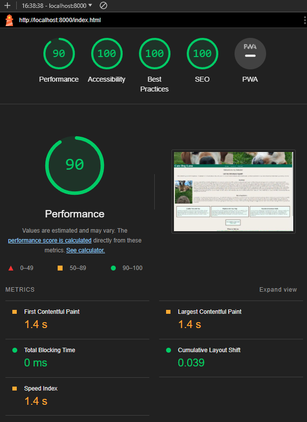
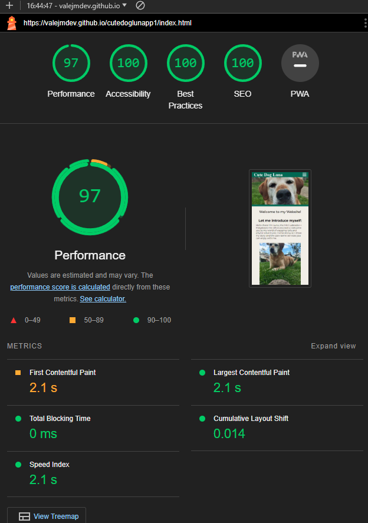
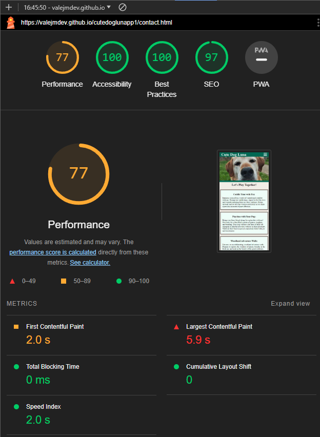
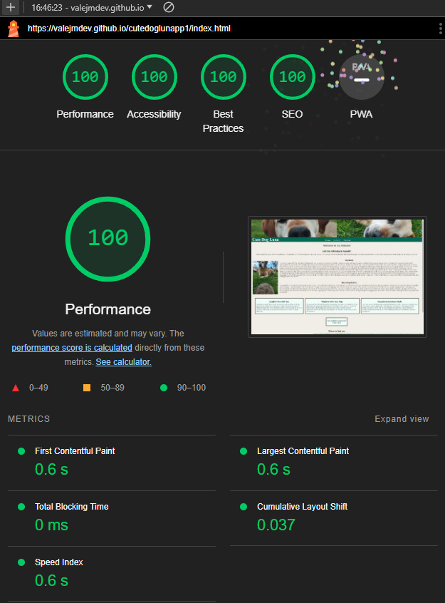
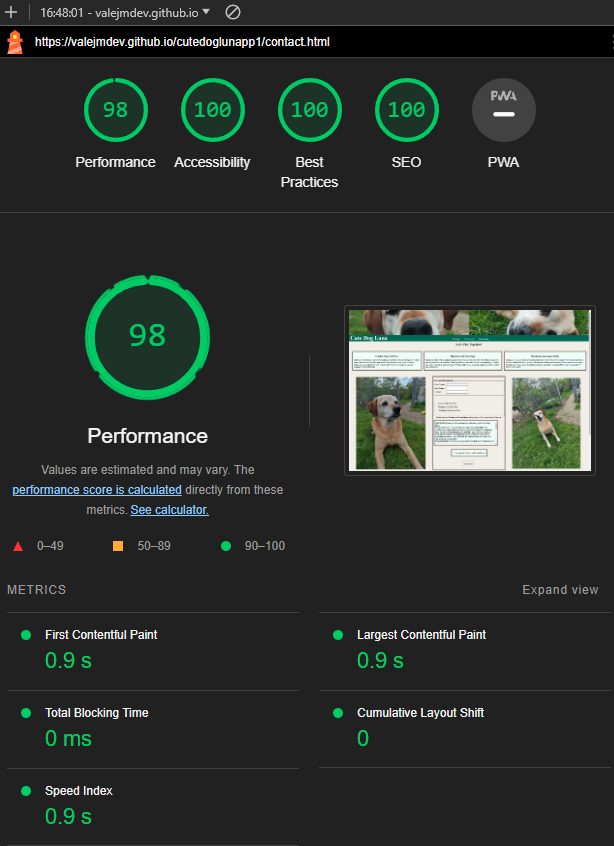

# Lighthouse Accessability Validation of Code
## Testing:
All of the following screenshots have been taken in Chrome on a desktop PC. 
Testing has been done in Chrome, Firefox and Opera. 
All the values of the screenshots have been nearly the same on all browsers and all
devices i tested on (only performance varies).
Tests have been made on 3 different dekstop PC's and 2 Laptops.

## Local Host Mobile:

 **Home page:**

 **Gallery page:**

 **Contact page:**

## Local Host Desktop:

 **Home page:**

 **Gallery page:**

 **Contact page:**

## Github Pages Mobile:

 **Home page:**

 **Gallery page:**

 **Contact page:**

## Github Pages Desktop:

 **Home page:** 
 Excuse the little Fireworks, i tried my best to hit the best Frame.

 **Gallery page:**

 **Contact page:**

