## Testing:  
 1. [Testing](#Testing)
	1. [General Testing](#General-Testing)
	2. [Mobile Testing](#Mobile-Testing)
	3. [Desktop Testing](#Desktop-Testing)
	4. [Functionality](#Functionality)
 	5. [Website Development Issues](#Website-Development-Issues)
 	6. [Bugs](#Bugs)
 	7. [Technologies Used](#Technologies-Used)
 	8. [Validation](#Validation)
	9. [W3C HTML](#W3C-HTML)
	10. [W3C Jigsaw](#W3C-Jigsaw)
 	11. [Accessibility](#Accessibility)
 	12. [Deployment](#Deployment)
### General Testing
-   Each feature was developed on the main branch, 
-   Each time a feature was added, all the functions were tested to see if there was an impact.
-   The site was sent to friends for feedback and testing.
-   All forms have validation and will not submit without the proper information.
-   .gitignore file has been included to prevent system file commits.
-   The image loading blur has been thoroughly tested and gone through numerous iterations to   optimized the smoothness of the transition on different devices and internet speeds.
-   Backup Map functions have been tested in a local deployment.
-   Email error functions have been tested offline as well.
-   External links open in a new tab.

### Mobile Testing

-   I tested the site personally on my Android device, going through the entire process, checking buttons, functions, checking out, etc. I was personally unable to test on iOS.
-   The site was sent to friends and relatives for them to follow the same process. They have tested on their devices, only missing iOS devices.
- The testing was done using the Google Chrome Browser. Chrome Developer Tools were used extensively, particularly to check responsiveness on different screen sizes. Testing was also done using Firefox and Opera on desktop, and again on Google Chrome and Opera and Brave on the Nothing Phone (2).
-   Responsive on all device sizes between 320px - 2600px wide.
-   Devices tested using the Google Developer Tools emulator:

| Device                   | Device Size    | Tested |
|--------------------------|----------------|--------|
| BlackBerry Z30           | 360px x 640px  | ✅     |
| BlackBerry PlayBook      | 600px x 1024px | ✅     |
| Samsung Galaxy Note 3    | 360px x 640px  | ✅     |
| Samsung Galaxy S3        | 360px x 640px  | ✅     |
| Samsung Galaxy S9+       | 320px x 658px  | ✅     |
| LG Optimus L70           | 384px x 640px  | ✅     |
| Microsoft Lumia 550      | 640px x 360px  | ✅     |
| Microsoft Lumia 950      | 360px x 640px  | ✅     |
| Nexus 4                  | 384px x 640px  | ✅     |
| Nokia Lumia 520          | 320px x 533px  | ✅     |
| Nokia N9                 | 480px x 854px  | ✅     |
| Pixel 3                  | 393px x 786px  | ✅     |
| Apple iPad Mini          | 468px x 4024px | ✅     |
| Apple iPhone 4           | 320px x 480px  | ✅     |
| Apple iPhone 5/S         | 320px x 568px  | ✅     |
| Apple iPhone 6/7/8       | 375px x 667px  | ✅     |
| Apple iPhone 6/7/8 Plus  | 414px x 736px  | ✅     |
| Apple iPhone X           | 375px x 812px  | ✅     |

### Desktop Testing
-   The site was developed on a Desktop PC and the majority of testing occurred on Chrome.
-   The site was tested by friends and relatives on numerous desktop devices.
-   The site was marginally tested on other browsers, such as Firefox and Opera.
-   Internet Explorer was not tested and the site was not developed with it in mind as support for the browser is gradually 		being dropped.

### Functionality
-   All links have been hovered and clicked to ensure accessibility.
-   Pages all load correctly on all device screen sizes.
-   All social media links work correctly and open on a new tab.
-   All images load on each page as intended.
-   All the buttons are working correctly and bring the users to the function that they were built for.
-   I have checked that the contact form requires valid inputs and can't be submitted without them.

## Website Development Issues
    
At the initial stages of my project, I made an error how and when to use GitCommit and GitPush. Following my second call with my mentor, he clarified how to do it, and I have followed his recommended approach.

## Technologies Used

For the purpose of this project, the following technologies were used.

### Languages:
- **HTML**
- **CSS**
***
### Frameworks, Libraries, Programs & Applications Used:
**Google Font**
Google fonts were used to import the following fonts Montserrat and Lato. These were imported to style.css and were used throughout the project.
**Font Awesome**
Font Awesome was used on each page of the website to provide icons for UX purposes.
**GitPod**
GitPod was used for writing all the code for this project. It was also used to commit and push to GitHub.
**VSCODE**
VSCOODE was used for writing and testing the code localy for this project. It was also used in combination with GitPod.
**GitHub**
GitHub was used to store this project.
**GitPages**
GitPages was used to deploy the project.
**Balsamiq**
Balsamiq was used to draw initial Wireframes for this project.
**Am I Responsive**
Am I Responsive was used to check that each page of the site was responsive. It was also used to create the mock-up image seen at the beginning of this document.
**Google Development Tools**
Google Dev Tools was used to edit code and check responsiveness before making the changes permanent.

## Bugs

This table summarizes the issues encountered, their current status, and any actions taken to address them.

| Issue                                                          | Status                                        |
|----------------------------------------------------------------|-----------------------------------------------|
| Display error of Header background images on certain sizes      | ✅ fixed with deleting width from 2 style rules |
| Layout error on Gallery Page                                   | ✅ fixed with using flexbox and creating more divs |
| Navbar position error, leaving the page to the side            | ✅ fixed by giving padding and deleting margin from certain elements |
| Integration error of calend.ly for availability of Bookings    | ❌ not fixed, due to missing time, will be implemented in the future |

## Validation: 
### W3C HTML: 
I used the [W3C HTML Validator](https://validator.w3.org/nu/)

| Pages    | Screenshot                                    |
|----------|-----------------------------------------------|
| Home     | 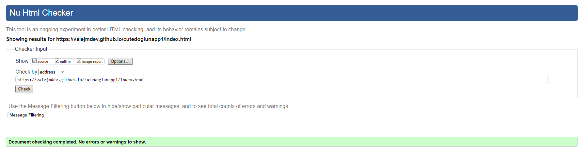 |
| Gallery  | 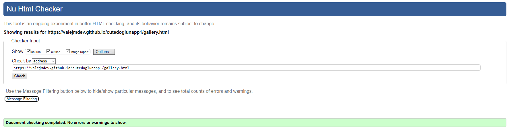 |
| Contact  | 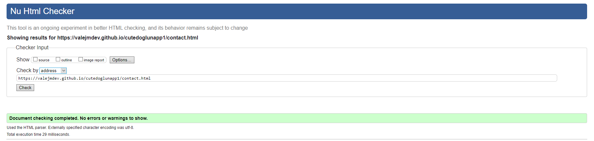 |
| 404 	   | 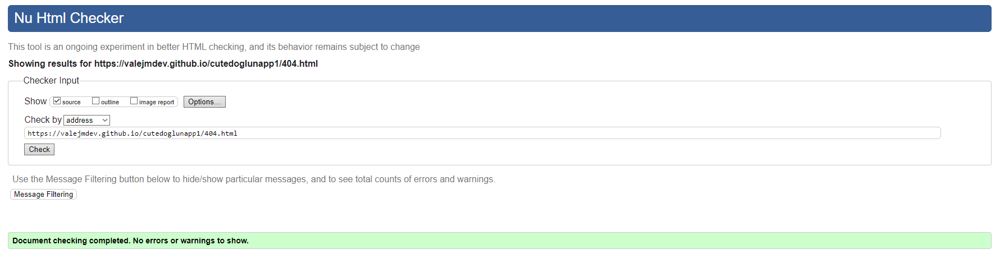 |

### W3C Jigsaw: 
I used the [W3C CSS Jigsaw Validator](https://jigsaw.w3.org/css-validator/)

## Accessibility: 
I used the Chrome Lighthouse tool and received different scores for different pages and devices.
| Environment         | Page   | Screenshot                                    |
|---------------------|--------|-----------------------------------------------|
| Local Host Mobile   | Home   | 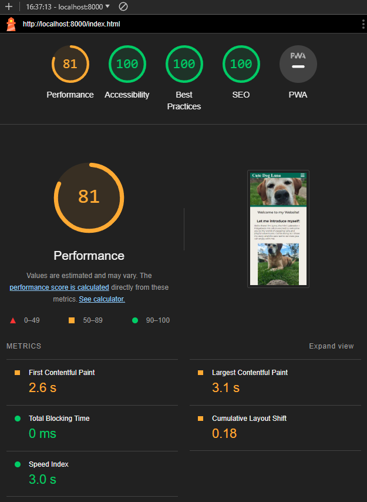     |
| Local Host Mobile   | Gallery| 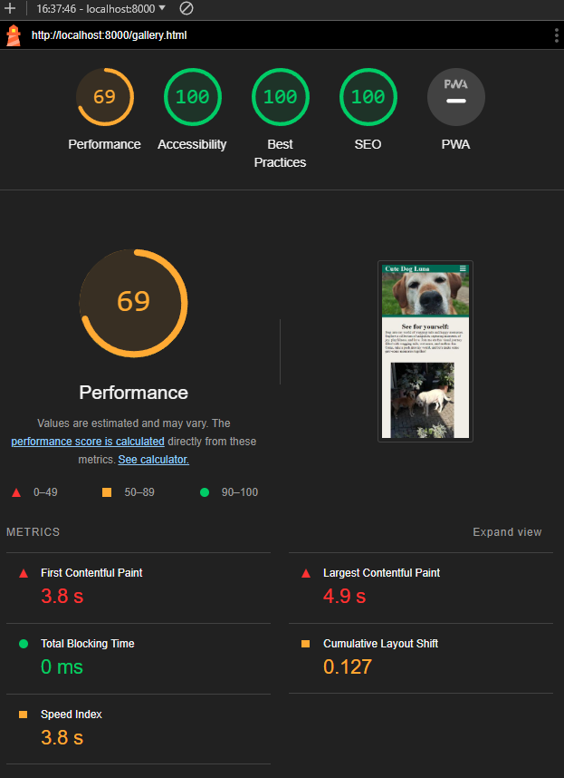 |
| Local Host Mobile   | Contact| 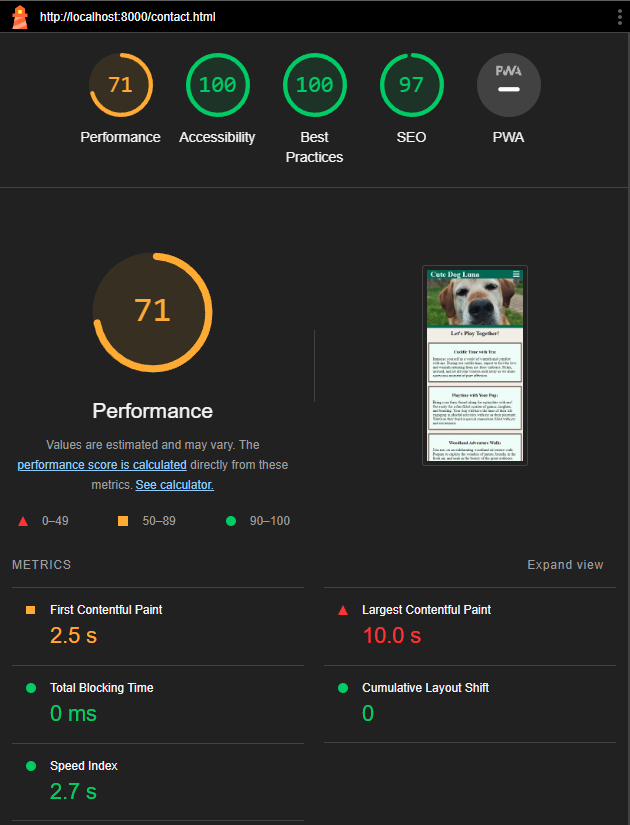 |
| Local Host Desktop  | Home   |      |
| Local Host Desktop  | Gallery| 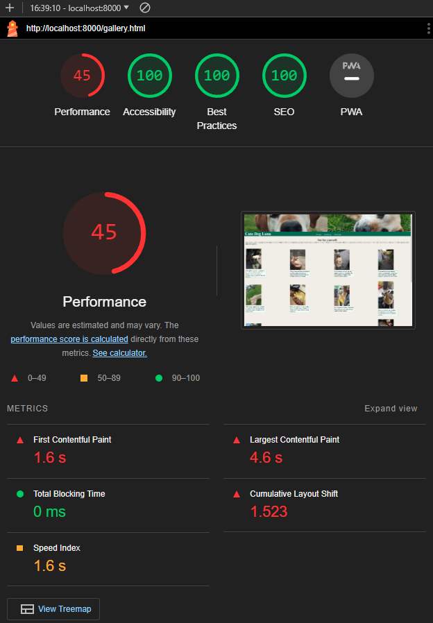 |
| Local Host Desktop  | Contact| 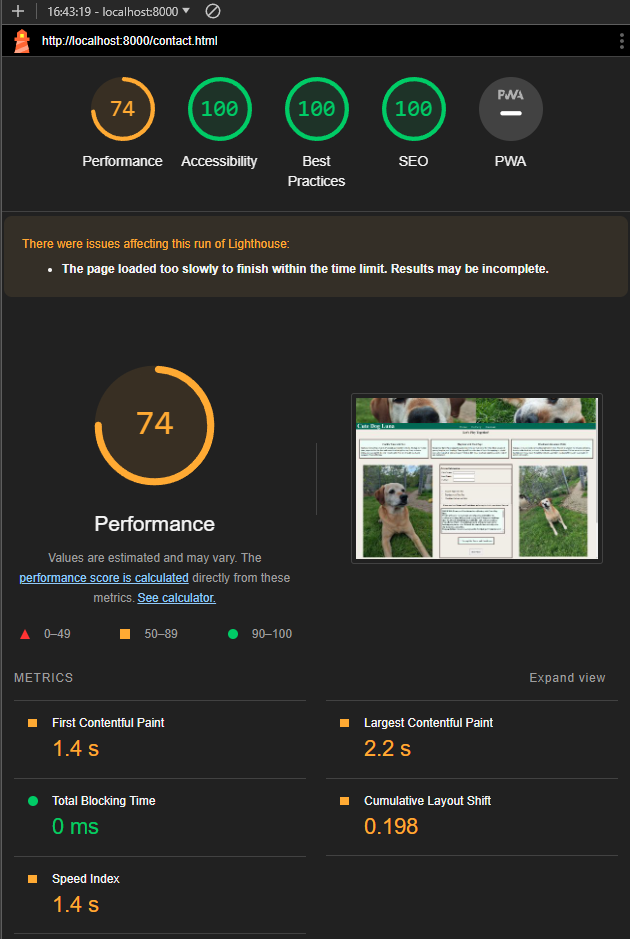 |
| Github Pages Mobile | Home   |  |
| Github Pages Mobile | Gallery| 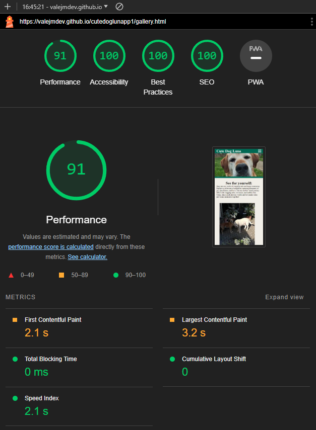 |
| Github Pages Mobile | Contact|  |
| Github Pages Desktop| Home   |  |
| Github Pages Desktop| Gallery| 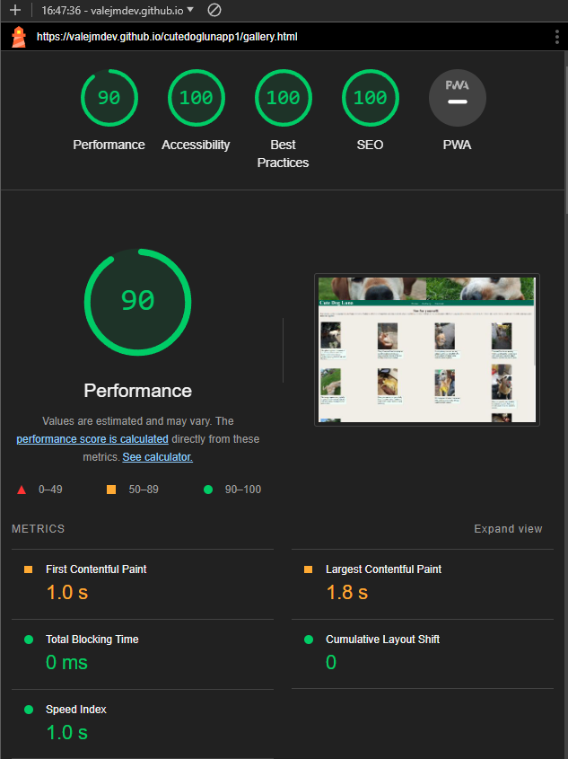 |
| Github Pages Desktop| Contact|  |

## Deployment: 
This project was developed using [GitPod](https://gitpod.io/) and [VSCode](https://code.visualstudio.com), committed and pushed to [GitHub](https://github.com/) using a GitPod terminal.

-   This site was deployed by completing the following steps:

The steps to activate Github pages are as follows:
1.   Navigate to the settings tab in the GitHub repository.
2.   In the settings, navigate to the 'Pages' tab on the left of the page.
3.   In the 'Build and deployment' section, select 'Deploy from a branch' in the source dropdown.
4.   Select branch 'main' and click on 'Save'.

The live link can be found here:  [Cute Dog Luna](https://valejmdev.github.io/cutedoglunapp1/)

### Forking This Project

-   Fork this project following the steps:

1.  Open  [GitHub](https://github.com/).
2.  Click on the project to be forked.
3.  Find the 'Fork' button to the top right of the page.
4.  Once you click the button the fork will be in your repository..

### Cloning This Project
-   Clone this project following the steps:

1.  Open  [GitHub](https://github.com/).
2.  Click on the project to be cloned.
3.  You will be provided with three options to choose from, HTTPS, SSH or GitHub CLI, click the clipboard icon in order to copy the URL..
4.  Once you click the button the fork will be in your repository.
5.  Open a new terminal.
6.  Change the current working directory to the location that you want the cloned directory.
7.  Type 'git clone' and paste the URL copied in step 3.
8.  Press 'Enter' and the project is cloned.

Further Information on how to deploy the project on VS Code and even more can be found [here](https://github.com/MicrosoftDocs/visualstudio-docs/blob/main/docs/get-started/tutorial-open-project-from-repo.md)!
